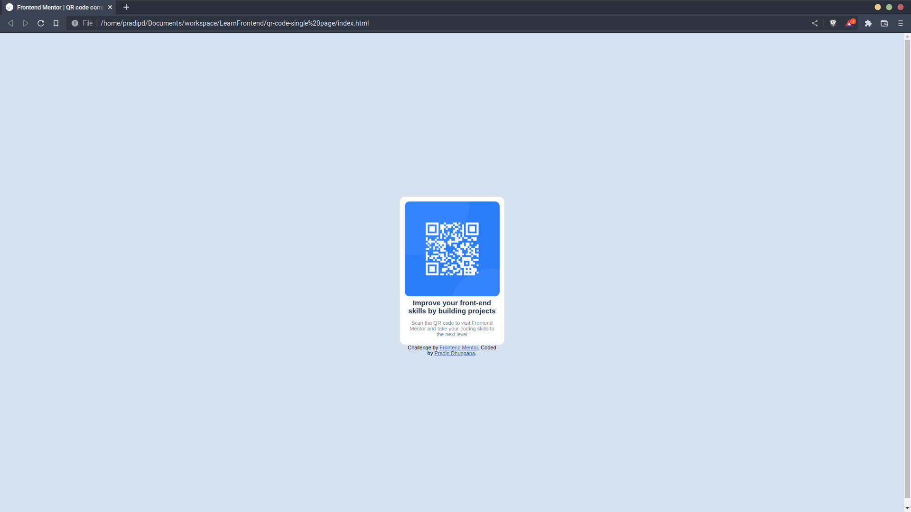
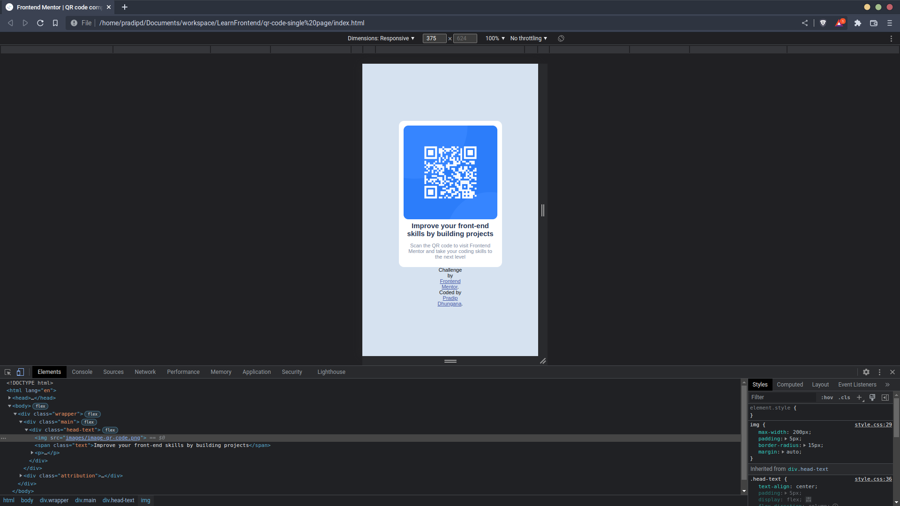

# Frontend Mentor - QR code component solution

This is a solution to the [QR code component challenge on Frontend Mentor](https://www.frontendmentor.io/challenges/qr-code-component-iux_sIO_H). Frontend Mentor challenges help you improve your coding skills by building realistic projects. 

## Table of contents

- #overview
  - #screenshot
  - #Built With
  - #screenshot

## Overview

### Screenshot
#### Desktop-View

#### Mobile-View

### Built with

- Semantic HTML5 markup
- CSS custom properties
- Flexbox

## Author

- Website - [Pradip Dhungana](https://www.dhunganapradip.com.np)
- Frontend Mentor - [@dhunganaPradeep](https://www.frontendmentor.io/profile/dhunganaPradeep)

